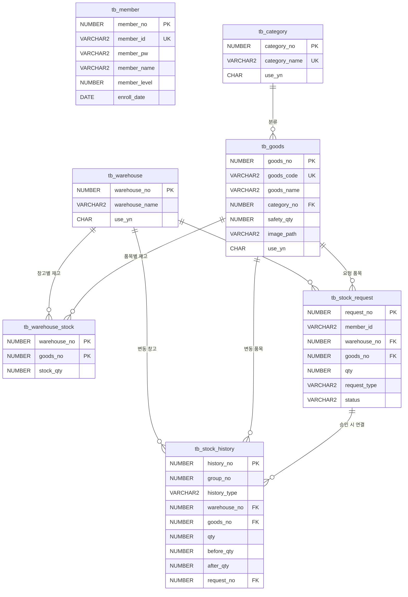
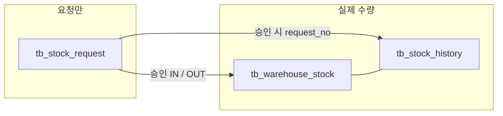

# StockHub ERD

기준: `sql/schema.sql` (테이블 7개). 기획서 6장의 실제 테이블명은 `tb_` 접두어를 쓴다.

## 1. 관계 개요

재고의 기준은 **창고 × 품목** (`tb_warehouse_stock`)이다.  
품목 전체 수량 = 해당 품목의 창고 재고 합계.

- `tb_stock_request`: 입고·출고 **요청만**. 이 테이블에서 재고를 직접 바꾸지 않는다.
- `tb_stock_history`: 실제로 수량이 변한 기록만. `history_type`은 `IN` / `OUT` / `ADJUST`.
- 창고 이동은 화면 1건, DB는 같은 `group_no`의 OUT+IN 두 행.

## 2. 관계 설명

| 관계 | 카디널리티 | 설명 |
|---|---|---|
| tb_category → tb_goods | 1 : N | 품목은 카테고리 하나. `category_no` FK |
| tb_warehouse × tb_goods → tb_warehouse_stock | N : M | 복합 PK `(warehouse_no, goods_no)`. 현재고 |
| tb_warehouse → tb_stock_request | 1 : N | 입고 또는 출고할 창고 |
| tb_goods → tb_stock_request | 1 : N | 요청 품목 |
| tb_warehouse → tb_stock_history | 1 : N | 이 행의 before/after가 가리키는 창고 |
| tb_goods → tb_stock_history | 1 : N | 변동 품목 |
| tb_stock_request → tb_stock_history | 1 : 0..N | 요청 승인이면 `request_no` 있음. 관리자 직접 입출고·이동·조정은 null |

논리 FK(DDL에는 없음)

| 컬럼 | 참조 | 이유 |
|---|---|---|
| tb_stock_request.member_id | tb_member.member_id | 요청자 아이디. 탈퇴해도 이력·요청 문구는 남긴다 |
| tb_stock_request.process_member_id | tb_member.member_id | 승인자 |
| tb_stock_history.member_id | tb_member.member_id | 처리자 |

## 3. 재고가 움직이는 경로

| 화면 | stock | history |
|---|---|---|
| 입고 요청 승인 | 해당 창고 + | IN 1행, `request_no` 있음 |
| 출고 요청 승인 | 수량 충분할 때만 − | OUT 1행, `request_no` 있음 |
| 요청 거절·취소 | 변동 없음 | 없음 |
| 관리자 입고/출고/조정 | ± | IN / OUT / ADJUST 1행 |
| 창고 이동 | 출발 −, 도착 + | OUT+IN 2행, 같은 `group_no` |

## 4. 시퀀스

| 시퀀스 | 사용 테이블 | PK |
|---|---|---|
| seq_member | tb_member | member_no |
| seq_warehouse | tb_warehouse | warehouse_no |
| seq_category | tb_category | category_no |
| seq_goods | tb_goods | goods_no |
| seq_request | tb_stock_request | request_no |
| seq_history | tb_stock_history | history_no |
| seq_group | tb_stock_history | group_no (작업 묶음) |

DDL: `sql/schema.sql`. 컬럼 상세는 [테이블 정의서](테이블정의서.md).
